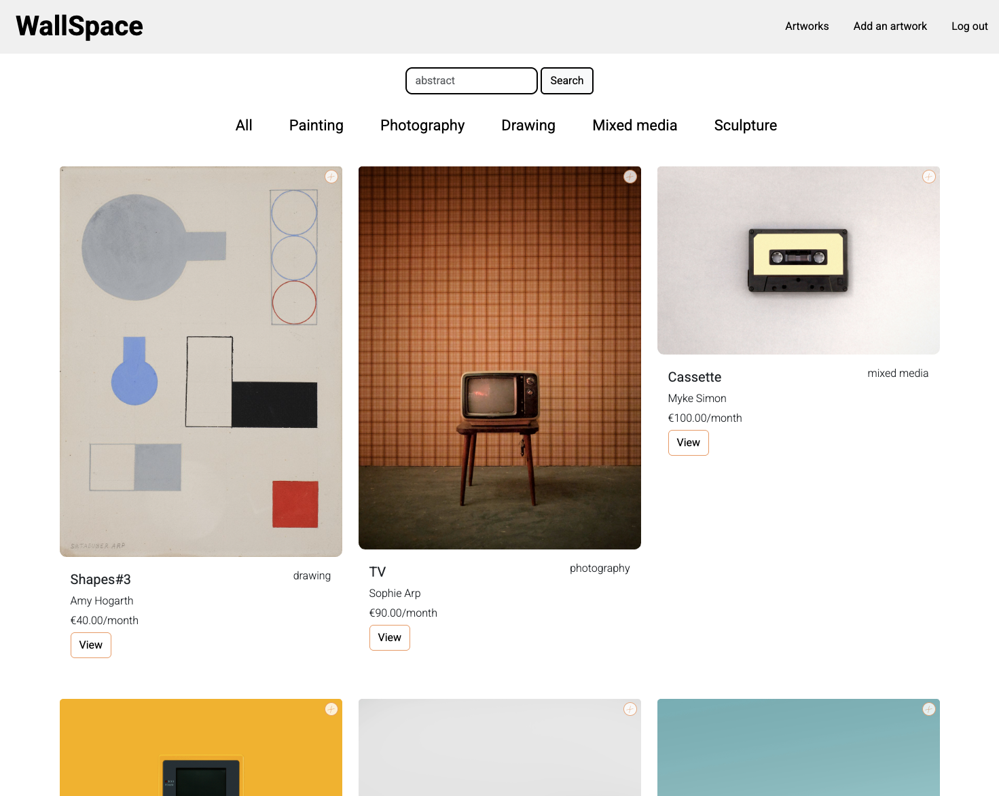
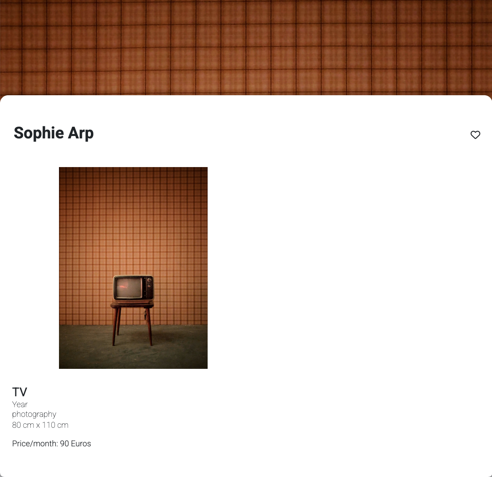
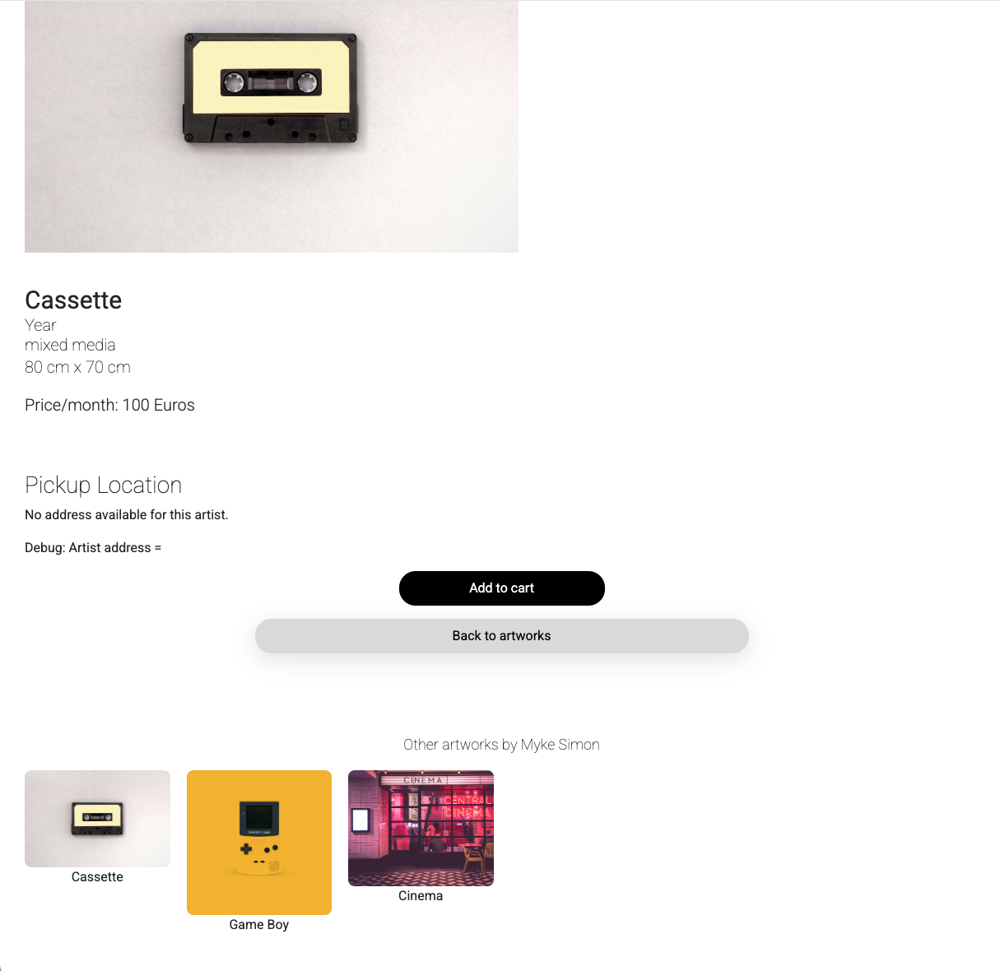
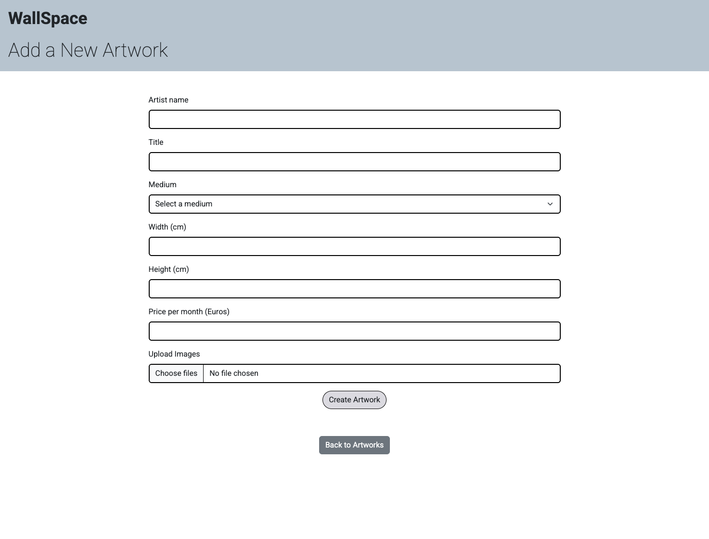

# WallSpace - Art Rental Platform

## Status: in development

## 🖼️ Project Overview  

This project involves building a webiste using Ruby on Rails where artists can make a profile and upload work they would like to rent out in their area. Customers can browse and filter artworks, view details, see other works by that artists and add items to their cart. The website design was done in Figma.


## 📸 Screenshots  

### 🖥️ Desktop View  

 
</br>
  
</br>
 
</br>
  


## 🎯 Aims

- Build a fast, lightweight, and responsive web application.
- Implement user authentication for artists and customers.
- Create an intuitive UI with a smooth browsing experience.
- Develop an efficient filtering system for artworks based on categories and key words.
- Support secure transactions for renting artworks.
- Ensure image optimisation for fast loading speeds.

## 🛠️ Challenges & Solutions

**💻 Implementing User Authentication with Devise**

**✅ Solution:** Integrated Devise for a secure and scalable authentication system, allowing artists and customers to manage their accounts seamlessly.

**💻 Optimising Image Uploads for Performance**

**🚧 In Progress:** Integration of Active Storage with Cloudinary to serve responsive, auto-optimised images without slowing down the site.

**💻 Ensuring Smooth Checkout and Payment Processing**

**🚧 In Progress:** Integration of Stripe API for secure payment processing and a smooth rental checkout experience.


## 🛠 Tech Stack

- **Framework:** [Ruby on Rails](https://rubyonrails.org/)
- **Database:** PostgreSQL
- **Authentication:** Devise
- **Hosting:** Heroku 
- **Image Optimisation & Storage:** Active Storage with Cloudinary
- **Front-End:** Bootstrap, SCSS
- **Payments:** Stripe API 
- **Design & Prototyping:** Figma


## 🚀 Getting Started

### Prerequisites

Ensure you have the following installed:

- Ruby & Rails
- PostgreSQL
- Node.js & Yarn (for asset pipeline)

### Installation

1. Clone the repo:
   ```sh
   git clone https://github.com/your-repo-url.git  
   cd your-project  
   ```
2. Install dependencies:
   ```sh
   bundle install  
   yarn install  
   ```
3. Set up the database:
   ```sh
   rails db:create db:migrate db:seed  
   ```
4. Start the server:
   ```sh
   rails s  
   ```
5. Open `http://localhost:3000` in your browser.


## 📞 Contact  

📧 **Email:** rohogarth@email.com  
🔗 **Portfolio:** [https://wondrous-sprite-d950e1.netlify.app/](https://wondrous-sprite-d950e1.netlify.app/)  
💼 **LinkedIn:** [https://www.linkedin.com/in/rosemary-hogarth/](https://www.linkedin.com/in/rosemary-hogarth/)  

